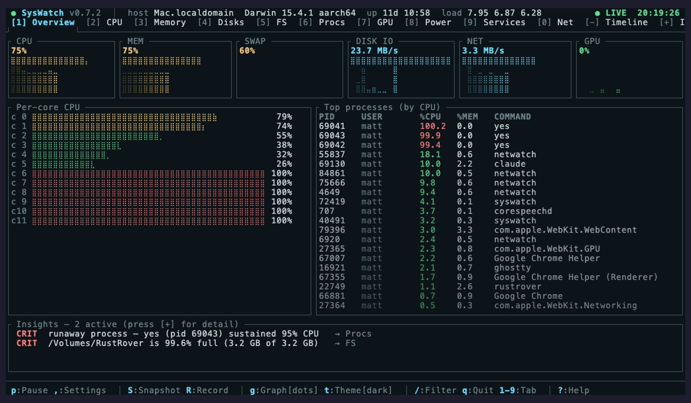

<p align="center">
  <h1 align="center">SysWatch</h1>
  <p align="center">
    <strong>Single-host system diagnostics in your terminal. The terminal you open when something feels off — before you reach for htop, iostat, nettop, powermetrics, and a notebook full of one-liners.</strong>
  </p>
  <p align="center">
    
    
    
  </p>
</p>

<p align="center">
  <em>Sibling to <a href="https://github.com/matthart1983/netwatch">NetWatch</a> (network) and <a href="https://github.com/matthart1983/diskwatch">DiskWatch</a> (disk). Same chrome. Same palette. Twelve tabs covering everything that runs on one box.</em>
</p>

<p align="center">
  
</p>

<p align="center">
  <strong>New in v0.7.0:</strong> the GPU tab — per-device utilization &amp; VRAM as ~120s time-series, with the renderer/tiler engine split on Apple Silicon, temp and power. No sudo.
</p>

---

## What it shows

| # | Tab | Replaces |
|---|---|---|
| 1 | Overview | dashboard view of all subsystems |
| 2 | CPU | `htop` CPU panel, `top -d`, `mpstat` |
| 3 | Memory | `free`, `vm_stat`, `htop` mem panel |
| 4 | Disks | `iostat`, `iotop` (aggregate) |
| 5 | Filesystems | `df -h`, `df -i`, `mount` |
| 6 | Procs | `htop`, `ps auxf`, `pstree` |
| 7 | GPU | `ioreg AGXAccelerator PerformanceStatistics` / `/sys/class/drm` |
| 8 | Power | `pmset`, `ioreg AppleSmartBattery` / `/sys/class/power_supply` |
| 9 | Services | `launchctl list` / `systemctl list-units` |
| 0 | Net | `nettop`, `iftop` |
| - | Timeline | (no equivalent — session log + scrubber) |
| + | Insights | (no equivalent — plain-English anomaly cards) |

Where `htop` shows you *what's running*, SysWatch shows you *what's happening* — across CPU, memory, IO, GPU, power, services — and tells you why in plain English when something's anomalous.

## Install

```bash
# Homebrew (macOS + Linux) — prebuilt binaries
brew install matthart1983/tap/syswatch

# Cargo
cargo install syswatch

# From source
git clone https://github.com/matthart1983/syswatch.git && cd syswatch
cargo build --release && ./target/release/syswatch
```

**Prerequisites (source/cargo builds):** Rust 1.75+. No system dependencies on Linux. macOS links against the system frameworks.

## Usage

```bash
syswatch                       # default 1Hz tick
syswatch --tick 500            # 2Hz
syswatch --tab procs           # boot straight into a tab
syswatch --replay session.swr  # scrub a recorded session
```

### Keys

```text
1 2 3 4 5 6 7 8 9   →  Overview / CPU / Mem / Disks / FS / Procs / GPU / Power / Services
0 - +               →  Net / Timeline / Insights
Tab / Shift-Tab     →  Cycle tabs
↑ / ↓               →  Select row (Procs, Services)
s                   →  Cycle sort (Procs, Services)
/                   →  Filter processes
← / →               →  Scrub session backward / forward
Home / End          →  Oldest sample / live
p                   →  Pause
g                   →  Graph style (bars / dots)
t                   →  Cycle theme
,                   →  Settings (tick, theme, btop-style fade)
S / R               →  Snapshot to disk / record session
?                   →  Help
q / Ctrl-C          →  Quit
```

## What's distinctive

**Insights tab.** Heuristic anomaly detection over the rolling session — swap thrash, runaway processes, disk full, memory pressure, high load, zombie parties — surfaced as plain-English cards with a suggested tab. The Overview's bottom strip and the tab bar's `[+]` badge keep them in sight from anywhere.

**Session-wide scrubbing.** The Timeline tab's `←/→` rewinds the entire app — every panel transparently shows historical state. `R` records a session to a `.swr` file; `--replay` scrubs it back later. `S` dumps the current snapshot to disk.

**Honest about platform limits.** Where data needs sudo (`powermetrics` for fans, per-component power, GPU util on Apple Silicon) the tab shows what we *can* get for free and a one-line note about what's gated. Nothing is faked, nothing prompts.

## Anti-goals

- **Not multi-host.** For fleet view, use NetWatch's web dashboard.
- **Not a daemon.** No long-running collector, no Prometheus push. The session is the database.
- **Not interactive remediation.** Read-only, deliberately. We don't kill, renice, unmount, or restart.
- **Not a logging product.** We surface OOM kills as a *signal* in Memory; we are not a log search UI.
- **Not pretty charts for screenshots.** Block sparklines, real numbers, no smooth curves, no themes-of-the-week.

## Scope

All twelve tabs render real data on macOS and Linux. Cross-platform collection via `sysinfo`; aggregate disk IO routes through [`netwatch-sdk`](https://github.com/matthart1983/netwatch-sdk) so SysWatch and the NetWatch agent share a single source of truth. Recording/Replay (`R` / `--replay`), Settings (`,`), Help (`?`), process filter (`/`), themes (`t`), and the btop-style fade rendering are all live.

**No sudo, ever.** GPU utilization, VRAM, and the renderer/tiler split on Apple Silicon come from `ioreg` (`AGXAccelerator PerformanceStatistics`); GPU temperature, per-rail power, and fans come from IOReport + SMC. Linux reads sysfs (`/sys/class/drm`, thermal zones, hwmon). Where a figure genuinely needs elevated access, the tab says so rather than prompting.

**Behind cargo features** — NVIDIA live GPU stats (`gpu-nvidia`, `nvml-wrapper`).

## Architecture

```text
src/
├── main.rs              CLI + entry
├── app.rs               Event loop, tab state, scrub plumbing
├── collect/             One Collector per subsystem; Snapshot the wire format
│   ├── collector.rs     sysinfo-backed CPU/Mem/Procs/Net + dispatch
│   ├── gpu.rs           ioreg AGXAccelerator / sysfs DRM / nvml
│   ├── macos_sampler.rs Shared IOReport + SMC worker (GPU/power/fans)
│   ├── power.rs         ioreg / pmset / sysfs power_supply
│   ├── services.rs      launchctl / systemctl
│   └── ring.rs          Bounded history + nth_back for scrubbing
├── insights/            Pure functions over (History, &Snapshot)
├── tabs/                One file per tab; thin renderers over the model
└── ui/
    ├── chrome.rs        Header, tab bar, footer
    ├── palette.rs       Single source of color truth
    └── widgets.rs       block_bar, sparkline, panel
```

Refresh model: a 1 Hz fast loop reads CPU/Mem/Net/IO in-process every tick; the heavier collectors run on their own budgets — processes every ~1.5 s, Power/Services every 5 s, per-process bandwidth on a background thread — so the loop stays cheap regardless of tick rate. The UI redraws on tick or keypress.

## License

MIT.
